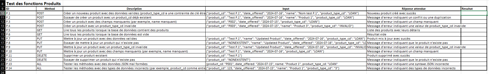
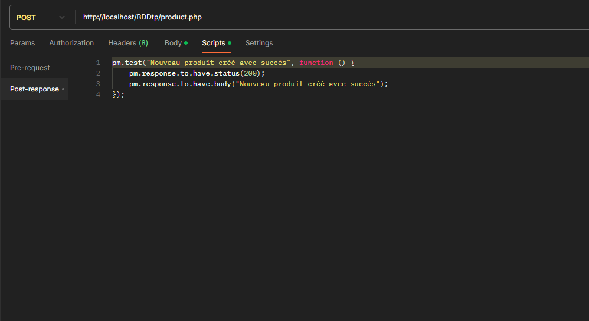

Tous les documents cités sont consultables dans le dépot.

# Test d'une API / rédaction cas de test 
Ce TP a pour objectif de decouvrir une API, la tester et rédiger un plan de test et des cas de test. 
Le but final est d'automatiser les tests dans Postman.
#### Outil utilisés:
  - Postman
  - DBeaver
  - Documentation de l'API

### API product.php
L'API que nous utiliserons dans ce TP permet d'interagir avec une base SQL qui liste des produits bancaires. 
La base SQL a été installée sur serveur local

### Deroulé du TP
#### **Test exploratoire/fonctionnel**
Nous allons d'abord executer les differentes requetes avec Postman afin de comprendre l'API. 
Grace à la documentation nous connaissons les differentes syntaxes des GET, POST, PUT et DELETE 
 

#### **Rédaction des cas de test et plan de test** 
Les reussites et les échecs rencontrés lors de notre phase exploratoire permettent de deduire les cas de test à mettre en place afin de couvrir l'ensemble des methodes.  
 

#### Automatisation des tests
Maintenant que nos test sont effectués et enregistrés dans Postman, la dernière étape est l'automatisation. 
Nous ajoutons à nos test des scripts JS afin de valider ou non la réponse renvoyée par le serveur et donc valider ou non nos tests. 
 

